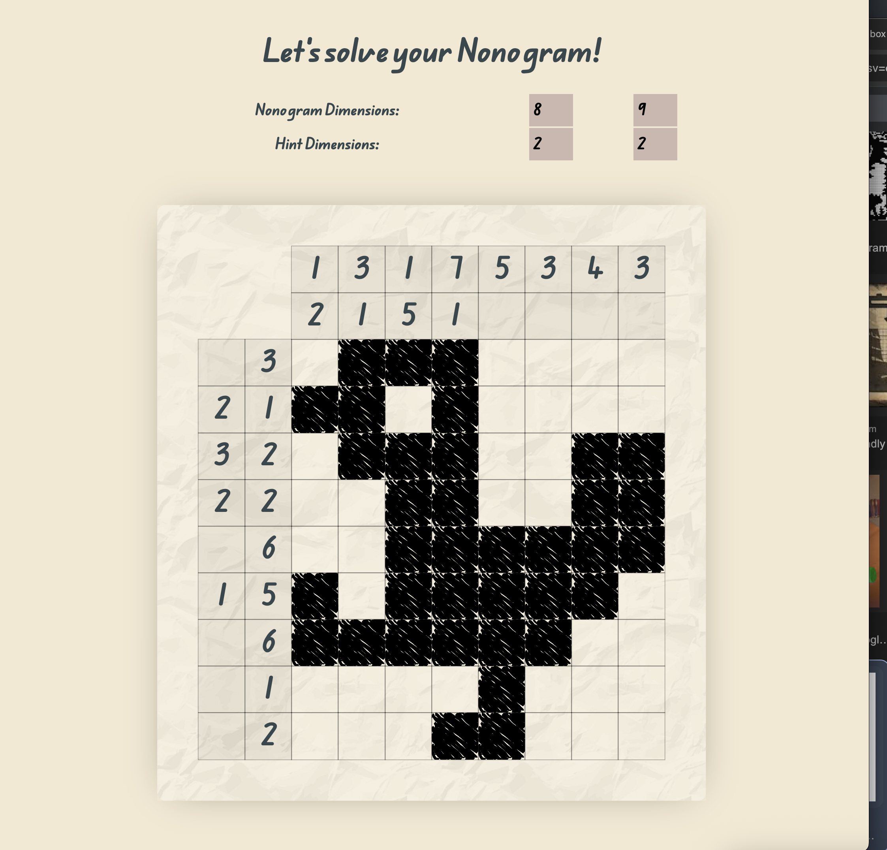
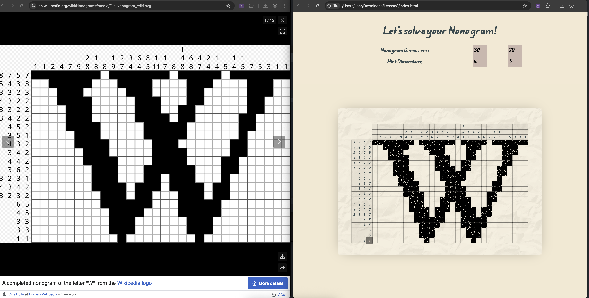
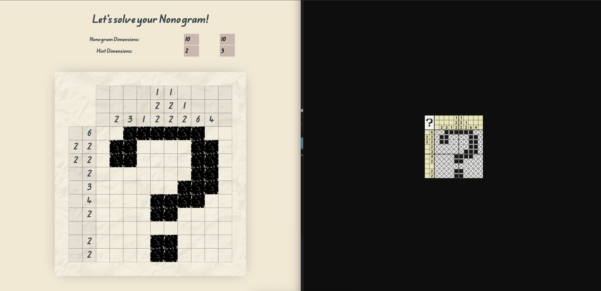

# nonogram-solver
Created for the "The art of solving Nonograms" workshop in TUMO\

Just input the hint numbers and the website will solve it for you.

## Try it [here](https://vardan2009.github.io/nonogram-solver).

## Screenshots

